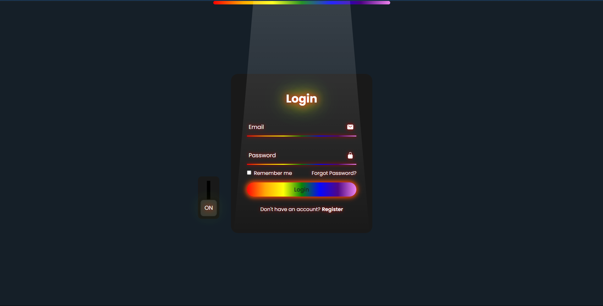
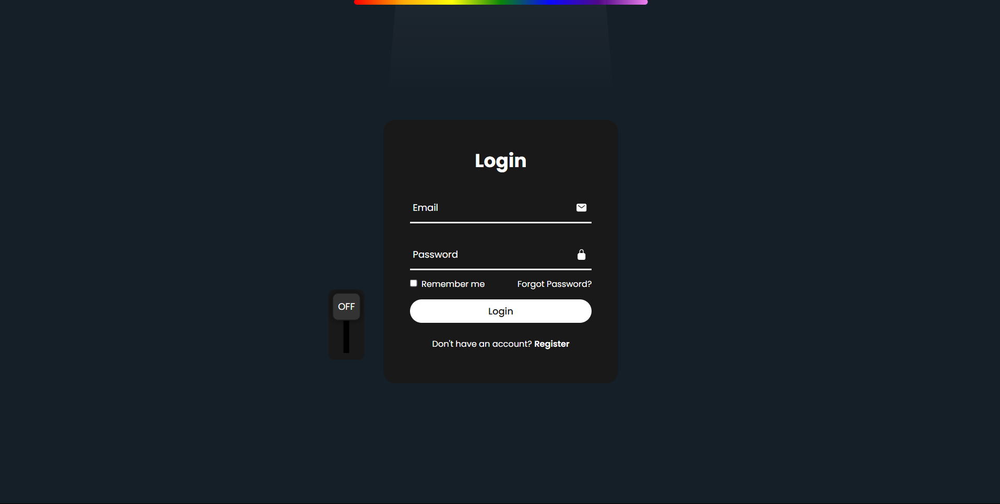

# Rainbow Login Page with Dark Mode

An innovative and visually stunning login page featuring vibrant rainbow hues and a dark mode toggle. This design prioritizes aesthetic appeal and user experience, offering a modern and dynamic interface for any web application.

## Features

- **Rainbow-Themed UI**: Vibrant and dynamic colors for an eye-catching experience.
- **Dark Mode Toggle**: Seamless switch between dark mode and rainbow-themed design.
- **User-Friendly Interface**: Clean and minimalistic design for intuitive navigation.

## Technologies Used

- **HTML5**: Structuring the web content.
- **CSS3**: Styling the interface with gradients and animations.
- **JavaScript**: Adding interactivity, including the dark mode toggle functionality.

## Screenshots

### Rainbow Mode


### Dark Mode


## How to Use

1. Clone the repository to your local machine:
   ```bash
   git clone https://github.com/yourusername/your-repo.git
   ```
2. Open the project folder and launch the `index.html` file in your browser.
3. Use the toggle switch to switch between Rainbow Mode and Dark Mode.

## Why Choose This Design?

This login page isn't just functional; it's designed to captivate users and make a lasting impression. Perfect for modern applications that value aesthetics as much as functionality.

## Feedback

We value your thoughts! Feel free to contribute or share your suggestions to enhance this project further.

---
**Experience the future of login interfaces today!**
